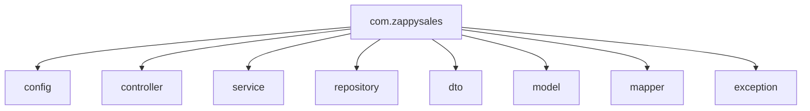

## Package Structure

```mermaid
flowchart TD

    ROOT["com.zappysales"]

    CONFIG["config"]
    CONTROLLER["controller"]
    SERVICE["service"]
    REPOSITORY["repository"]
    DTO["dto"]
    MODEL["model"]
    MAPPER["mapper"]
    EXCEPTION["exception"]

    ROOT --> CONFIG
    ROOT --> CONTROLLER
    ROOT --> SERVICE
    ROOT --> REPOSITORY
    ROOT --> DTO
    ROOT --> MODEL
    ROOT --> MAPPER
    ROOT --> EXCEPTION
```