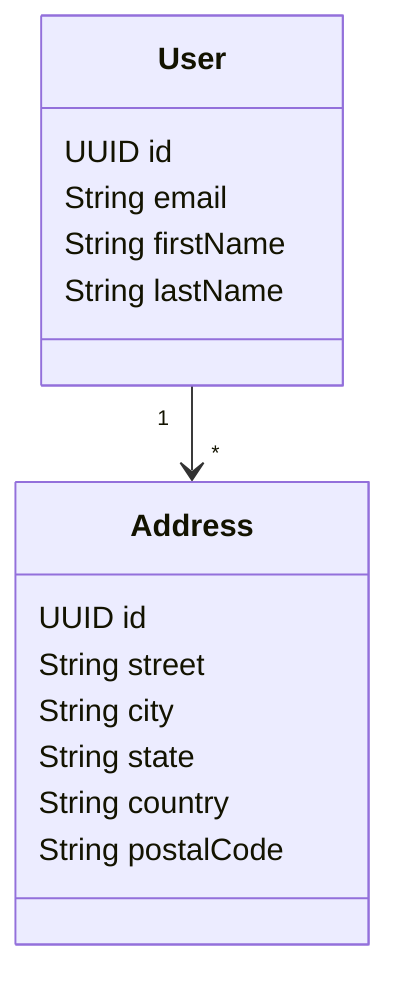

# Domain Model

```mermaid
classDiagram

    class User {
        UUID id
        String email
        String firstName
        String lastName
    }

    class Address {
        UUID id
        String street
        String city
        String state
        String country
        String postalCode
    }

    User "1" --> "*" Address
```