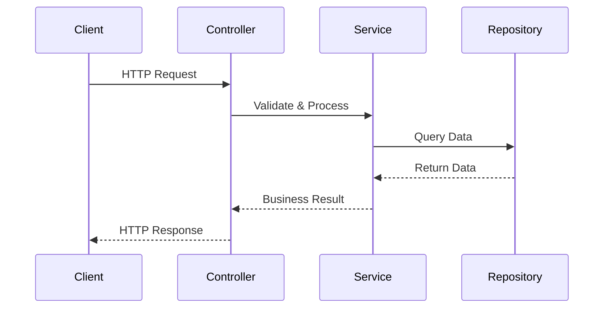

# Backend Request Lifecycle

```mermaid
sequenceDiagram

    participant Client

    participant Controller

    participant Service

    participant Repository

    Client->>Controller: HTTP Request

    Controller->>Service: Validate & Process

    Service->>Repository: Query Data

    Repository-->>Service: Return Data

    Service-->>Controller: Business Result

    Controller-->>Client: HTTP Response
```