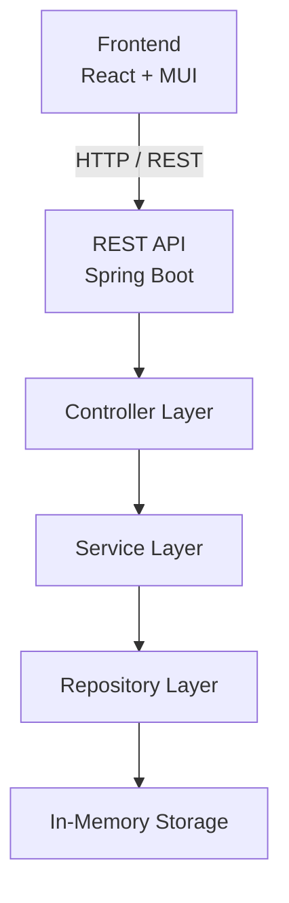
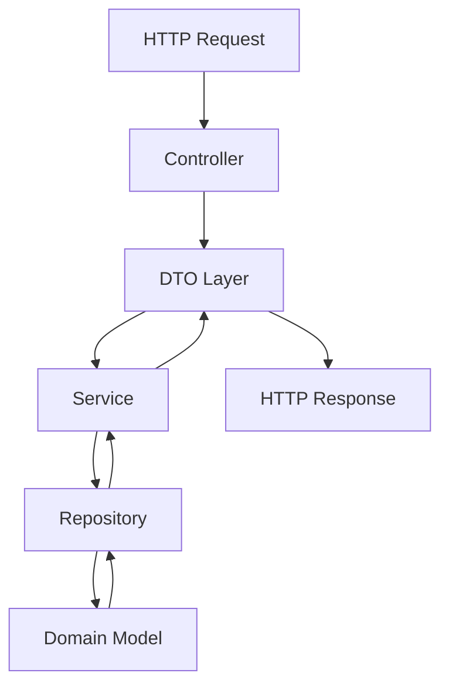
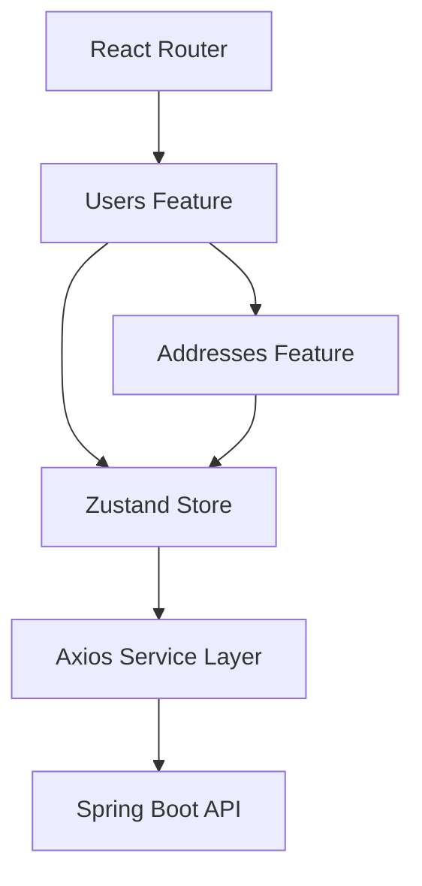

# ZappySales System Design

## Overview

ZappySales is a lightweight administrative user management application that allows administrators to:

- View users
- Update user profiles
- Manage multiple addresses per user
- Demonstrate clean frontend and backend architecture

---

## High-Level Architecture

---

## Backend Architecture

---

## Frontend Architecture

